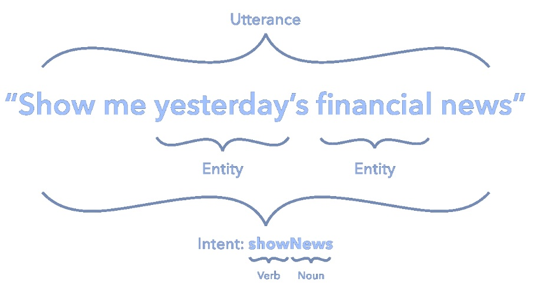

# Tutorial RASA
Disclaimer: __this is not an official tutorial by RASA.__   
I did this tutorial to help the italian comunity to get started with RASA.

[Link al tutorial ufficiale di Rasa](https://rasa.com/docs/rasa/user-guide/rasa-tutorial/).
### Intro
Che cos' è un __conversational__ bot ? [Link al video ufficiale di Rasa](https://www.youtube.com/watch?v=-F6h43DRpcU&feature=youtu.be&t=29)


### Intent Entities
Intent è qualcosa che l'utente vuol fare/comunicare.  
Entity è un termine o un oggetto che è rilevante/necessario per l'intent.



### Stories
Una Story(Dialog) è un flusso di conversazione che definisce le risposte agli intent definiti.


## Pizza bot 🍕
In questo tutorial costruiamo un bot che ci aiuti nella nostra pizzeria immaginaria, agevolando l'interazione utente-locale. 

Passo a passo vediamo quali file bisogna modificare per costruire il bot e quali funzionalità possiamo aggiungere.


## 0 Set up
### 0.1 Install Rasa
Suggerimento: installa tutto su un [virtual environment](https://www.anaconda.com/distribution/). 
```
pip install rasa
pip install spacy
python -m spacy download it_core_news_sm
python -m spacy link it_core_news_sm it
```
Cos'è [it_core_news_sm](https://spacy.io/models/it) ?
### 0.2 Init
Creiamo un dummy bot per iniziare.
```
rasa init --no-prompt
```
Rasa crea il progetto (con la struttura di default) di un bot minimale ma funzionante.
### 0.3 Italiano 
Impostiamo come lingua del bot italiano modificando il [file config.yml](config.yml): "language: __it__"
## 1 Let's start 🛫
### 1.1 domain.yml
Questo file contiene la definizione degli __intent - entities__ del bot.  
Pensiamo a quali intent-entities servono al nostro bot (slide esempio conversazione).  
Modifichiamo il file domain.yml con i nostri intent-entities.  

La sua struttura è:
```Markdown
intents: <!-- dichiarazione di tutti gli intent -->
  - greet
  - read_menu
<!-- ... -->

actions: <!-- dichiarazione di azioni del bot -->
- utter_greet
- utter_show_menu
<!-- ... -->

templates: <!-- frasi di risposta per ogni azione del bot -->
  utter_greet:
  - text: "Ciao"
  - text: "Salve"
<!-- ... -->
```

Il risultato finale deve essere [simile a questo](my_files/fasi/1_1_domain.yml).   

__Possiamo già parlare con il nostro bot?__

### 1.2 data/nlu.dm
Questo file contiene tutti gli esempi per il train degli entity.  
Aggiungiamo il nuovo intent ("read_menu") ed esempi di come gli utenti possono chiedere quali pizze siano presenti nel menù.  

La struttura di nlu.md è:
```markdown
<!-- nome dell'intent come definito in domain.yml (label) -->
## intent:affirm
- sì <!-- esempi -->
- certo

## intent:altro_nome
- altri esempi
- ...
```

Il risultato finale deve essere [simile a questo](my_files/fasi/1_2_nlu.md).

Partendo da questi facciamo il train del nlu.
```
rasa train nlu
```
Il modello viene salvato, ora vediamo se il bot capisce cosa gli diciamo:
```
rasa shell nlu
```
__Dati gli esempi forniti il bot è in grado di capire gli intent, cosa manca per una conversazione?__


### 1.3 data/stories.md
Questo file contiene le "stories" cioè i flussi del discorso fra utente e bot.   
Scriviamo la nostra prima storia immaginando un dialogo semplice dove l'utente saluta e chiede di poter vedere le pizze presenti nel menù, dall'altro lato il bot risponde al saluto e mostra il menù all'utente.  

La struttura di stories.md è:
```markdown
<!-- nome della storia (non importante) -->
## happy path 
* greet <!-- intent dell'utente (botta) -->
  - utter_greet <!-- action del bot (risposta) -->
* book_plane
  - utter_reservation_confirmed
```

Il risultato finale deve essere [simile a questo](my_files/fasi/1_3_stories.md).  

Ora possiamo fare il train completo (nlu + core).
```
rasa train
```
Finalmente possiamo avere una conversazione con pizza bot!
```
rasa shell
```
## 2 Rendiamolo più intelligente 🧙‍
Se ti sei perso qualche passaggio scarica la soluzione finora costruita:
```
git clone https://github.com/fabiodn/rasa_tutorial.git
git checkout tags/1.1 -b my_pizza_bot_1
```
### 2.1 Entities - ordiniamo una pizza
Link alla documentazione ufficiale [entities di Rasa](https://rasa.com/docs/rasa/nlu/training-data-format/#training-data-format).  
Per approfondire l'argomento leggi [questo post](https://blog.rasa.com/rasa-nlu-in-depth-part-2-entity-recognition/) sul blog ufficiale di Rasa.

Dento al file domain.yml, aggiungiamo l'utter "confirm_pizza", l'intent "order_pizza", l'entity "pizza_name" e lo slot corrispondente. 
Uno "slot" può essere considerato come una variabile: ha un tipo (in questo caso "text") e gli verrà assegnato un valore durante la conversazione, nel nostro caso il nome della pizza.

Il formato dentro il file domain.yml è: 
```markdown
slots: <!-- dichiarazione di tutti gli slot -->
  pizza_name: <!-- nome dello slot -->
    type: text
```

Link alla documentazione ufficiale sugli [slots](https://rasa.com/docs/rasa/core/slots/).

Dentro il file data/nlu.md, aggiungiamo gli esempi del nuovo intent "order_pizza" mettendo l'etichetta "pizza_name" agli entities: \[entity_example\]\(entity_name\)
```markdown
## intent:order_pizza
- Vorrei una pizza [margherita](pizza_name) <!-- [entity_example](entity_name) -->
- <!-- altri esempi di intent + entity -->
```

Dentro il file data/stories.md, aggiungiamo la nuova storia in cui ordiniamo una pizza e il bot ci conferma l'ordine.
```markdown
## Order pizza
* order_pizza{"pizza_name": "margherita"} <!-- intent dell'utente con slot -->
  - utter_confirm_pizza
```

A questo punto i tre file dovrebbero essere qualcosa di simile a questo: [domain](my_files/fasi/2_1_domain.yml), [nlu](my_files/fasi/2_1_nlu.md), [stories](my_files/fasi/2_1_stories.md).

### 2.2 Actions - un bot non solo chiacchiere !
Link alla documentazione ufficiale [Actions di Rasa](https://rasa.com/docs/rasa/core/actions/).

Quando il nostro bot accetta un ordine dovrebbe controllare se la pizza è sul menù e in caso affermativo passare l'ordine al pizzaiolo.

Per controlli e azioni Rasa mette a disposizione le Actions: classi in Python dove possiamo programmare cosa far fare al nostro bot.

Pensiamo a come strutturare il menù: serve un posto unico dove scrivere le pizze, sia per mostrarle quando l'utente ci chiede di vedere il menù sia per controllare che la pizza richiesta in un ordine sia effettivamente presente sul menù stesso.  
__Per comodità__ scegliamo che il file già creato per la lookup table data/pizze.txt ricopra questo ruolo.   Una soluzione più avanzata potrebbe prevedere __un database__ con pizza, ingredienti, tipo di farina ecc.
### 2.2.1 Definiamo le action: domain.yml e stories.md
Seguendo la convenzione dei nomi dentro rasa, nei file domain.yml e data/stories.md cambiamo i nomi da utterance a action :
```
utterance_confirm_pizza --> action_confirm_pizza
uttarance_show_menu --> action_show_menu
```

Inoltre dentro domain.yml cancelliamo i templates di utterance_confirm_pizza e uttarance_show_menu, sarà dentro le action stesse che decideremo cosa far rispondere al bot.
### 2.2.1 Actions == servizio REST
Le actions sono un servizio REST separato dal bot.  
Impostiamo il bot in modo che sappia su quale indirizzo contattare il servizio actions.

Nel file endpoints.yml "scommentiamo" le linee già pronte:
```
action_endpoint:
  url: "http://localhost:5055/webhook"
```
### 2.2.2 Just code it!
Rasa si aspetta le actions definite dentro il file actions.py, dentro infatti troviamo un'action (con la sua struttura) commentata.

La struttura:
```python
#Ogni action è una classe 
class ActionHelloWorld(Action):  
    def name(self) -> Text:
        return "action_hello_world" #Il nome deve essere uguale a quello definito in domain.yml 
#La funzione run è quella chiamata durante la conversazione
    def run(self, dispatcher: CollectingDispatcher,
            tracker: Tracker,
            domain: Dict[Text, Any]) -> List[Dict[Text, Any]]:

        entity = tracker.get_slot('entity_name') #funzione per recuperare entity
        dispatcher.utter_message("Hello World!") #risposta del bot
        return []
```

L'action __action_show_menu__ deve leggere le pizze disponibili (dal file data/pizze.txt) e inoltrare le informazioni all'utente.

L'action __action_confirm_pizza__ legge la pizza ordinata dall'utente dallo slot, controlla se la pizza è presente sul menù e di conseguenza comunica al cliente la presa in carico dell'ordine o meno.  
ATTENZIONE: lo slot può essere vuoto in caso NLU non riesca a estrarre correttamente il nome della pizza.

A questo punto i file modificati dovrebbero essere qualcosa di simile a questi: [domain](my_files/fasi/2_2_domain.yml), [stories](my_files/fasi/2_2_stories.md), [actions](my_files/fasi/2_2_actions.py) .

Proviamo il nostro pizza bot aggiornato!  
Come abbiamo detto le actions sono un servizio separato quindi dobbiamo lanciare actions e poi il bot.

``` 
rasa run actions
rasa run
```

## 3 Parliamo con il mondo intero: connettore telegram ! 🌍
Link alla documentazione ufficiale Rasa [connettore telegram](https://rasa.com/docs/rasa/user-guide/connectors/telegram/).

Uno dei punti di forza di Rasa è la semplicità con cui il nostro bot può comunicare attraverso più canali come telegram, google assistant, slack e [tanti altri](https://rasa.com/docs/rasa/user-guide/messaging-and-voice-channels/).

Usiamo [ngrok](https://ngrok.com/download) per creare facilmente un tunnel ed avere un indirizzo su cui esporre il nostro bot.
Per esporre il nostro bot (di default su localhost:5005):
``` 
ngrok http 5005
```
Una volta avviato ngrok ci fornisce un indirizzo __temporaneo__ di forward.


Per creare un bot su telegram parla con BotFather, usa il comando /newbot e segui le istruzioni.
A fine della procedura BotFather ci fornisce il token del bot appena creato.

Modifichiamo il file credentials.yml aggiungendo:
```yaml
telegram:
  access_token: "490161424:AAGlRxinBRtKGb21_rlOEMtDFZMXBl6EC0o"
  verify: "your_bot"
  webhook_url: "https://your_url.com/webhooks/telegram/webhook"
```
Dove access_token è il token dato da BotFather, verify è il nome ufficiale del bot (non lo username con cui ti risponde) e webhook_url è quello dato da ngrok aggiungendo "/webhooks/telegram/webhook".


### Risultato finale
Finalmente tutto il mondo può parlare con pizza bot:  
[Clicca qui per parlare con pizzabot!](https://t.me/tutorial_pizza_bot)

Ecco uno screenshot di una conversazione reale con pizza bot (presentata al linux day):  


## LINK UTILI
### Principali
- [Documentazione RASA](https://rasa.com/docs/)
- [Blog RASA](https://blog.rasa.com/)
- [Forum RASA](https://forum.rasa.com/)
- [Canale youtube RASA](https://www.youtube.com/channel/UCJ0V6493mLvqdiVwOKWBODQ)
### Temi trattatati nel tutorial
- [Domain](https://rasa.com/docs/rasa/core/domains/)
- [Formato Intent Entities](https://rasa.com/docs/rasa/nlu/training-data-format/)
- [Stories](https://rasa.com/docs/rasa/core/stories/)
- [Actions](https://rasa.com/docs/rasa/core/actions/)
- [Slot](https://rasa.com/docs/rasa/core/slots/)
- [Connettore Telegram](https://rasa.com/docs/rasa/user-guide/connectors/telegram/)
### Approfondimenti
- [Altri connettori](https://rasa.com/docs/rasa/user-guide/messaging-and-voice-channels/))
- [Pipeline](https://rasa.com/docs/rasa/nlu/choosing-a-pipeline/)
- [Entity Extraction](https://rasa.com/docs/rasa/nlu/entity-extraction/)
- [Google Assistant + RASA](https://blog.rasa.com/going-beyond-hey-google-building-a-rasa-powered-google-assistant/)
- [Knowledge base](https://blog.rasa.com/integrating-rasa-with-knowledge-bases/)


